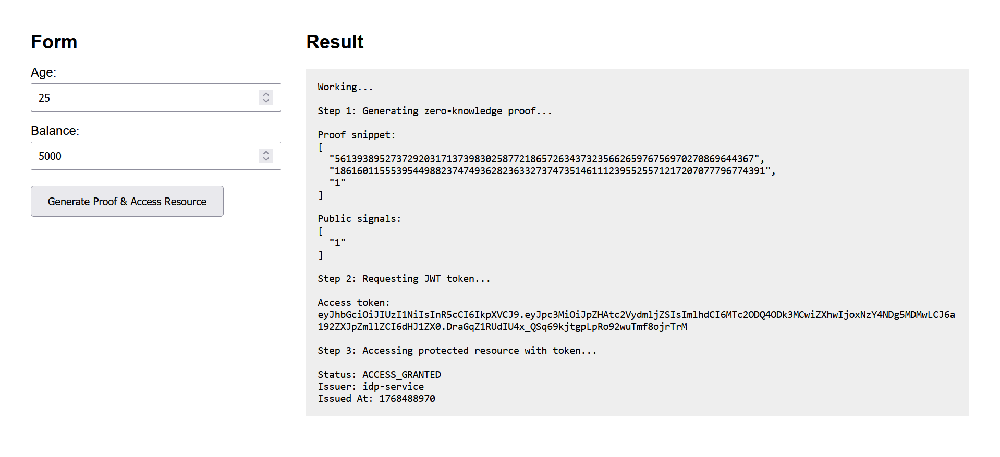
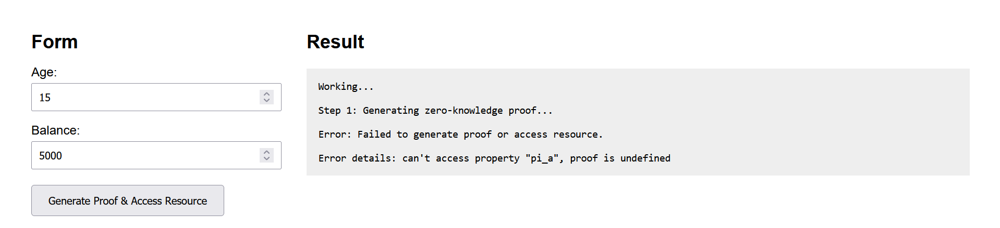
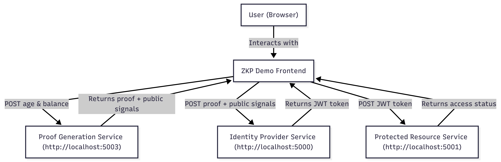
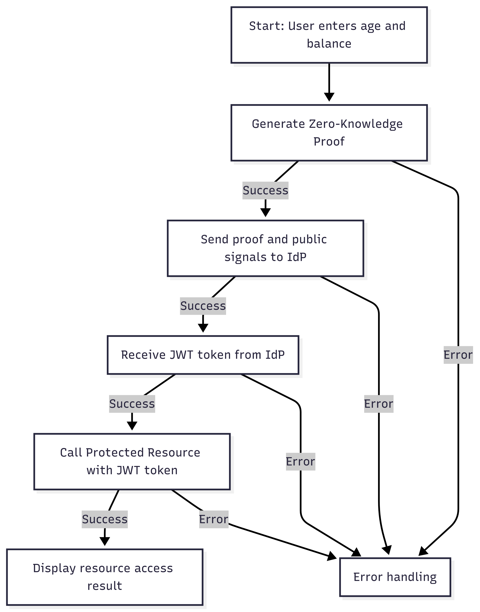
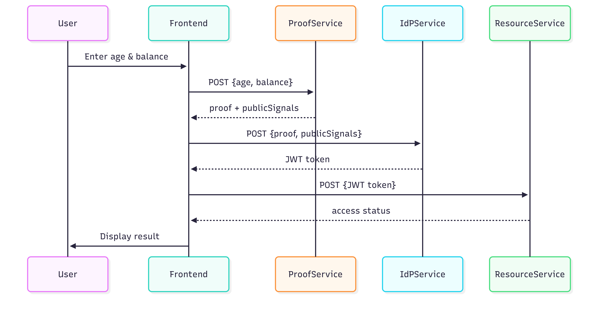

# Zero-Knowledge Proof (ZKP) Demo

This project is a simple web frontend + microservices demonstrating the flow of zero-knowledge proof generation and verification in a privacy-preserving authentication system.

---

## Project Overview

The UI allows users to simulate the generation of a zero-knowledge proof based on their **age** and **balance** inputs. This proof can then be used to request a JWT token from an Identity Provider (IdP), which in turn grants access to a protected resource without revealing sensitive data.

In real-world applications, the data for proof generation would come from secure services or databases rather than user input. This demo is intended purely for educational and simulation purposes.

---

## How It Works

1. **User Input**: The user enters their age and balance in the form.
2. **Proof Generation**: The frontend sends this data to a backend proof generation service, which returns a zero-knowledge proof and public signals.
3. **Token Issuance**: The proof is sent to an Identity Provider service, which verifies it and issues a JWT token.
4. **Resource Access**: The token is used to access a protected resource service that validates the token and returns an access status.

---

## Screenshots

### Access Granted UI  

### Access Not Granted UI  

---

## Diagrams

### Architecture Diagram  

### Flowchart  

### Sequence Diagram  

---

## Technologies Used

- HTML/CSS/JavaScript for the frontend UI
- Zero-Knowledge Proof backend service (simulated)
- JWT-based token issuance and verification
- REST APIs for communication between components

---

## Notes

- This project is for demonstration and learning purposes only.
- In production, proof generation and data validation must be done with trusted data sources.
- The communication between frontend and backend services is via HTTP requests to localhost endpoints.

---

This project is made as a final report submission for cryptography course @ustc's software engineering program.

---

