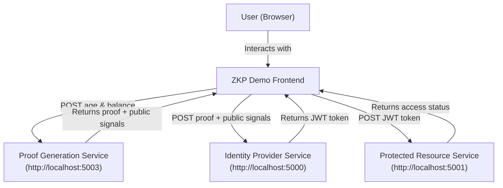

```mermaid
graph TD
  User["User (Browser)"]
  ZKPFrontend["ZKP Demo Frontend"]
  ProofService["Proof Generation Service\n(http://localhost:5003)"]
  IdPService["Identity Provider Service\n(http://localhost:5000)"]
  ResourceService["Protected Resource Service\n(http://localhost:5001)"]

  User -->|Interacts with| ZKPFrontend
  ZKPFrontend -->|POST age & balance| ProofService
  ProofService -->|Returns proof + public signals| ZKPFrontend
  ZKPFrontend -->|POST proof + public signals| IdPService
  IdPService -->|Returns JWT token| ZKPFrontend
  ZKPFrontend -->|POST JWT token| ResourceService
  ResourceService -->|Returns access status| ZKPFrontend
```