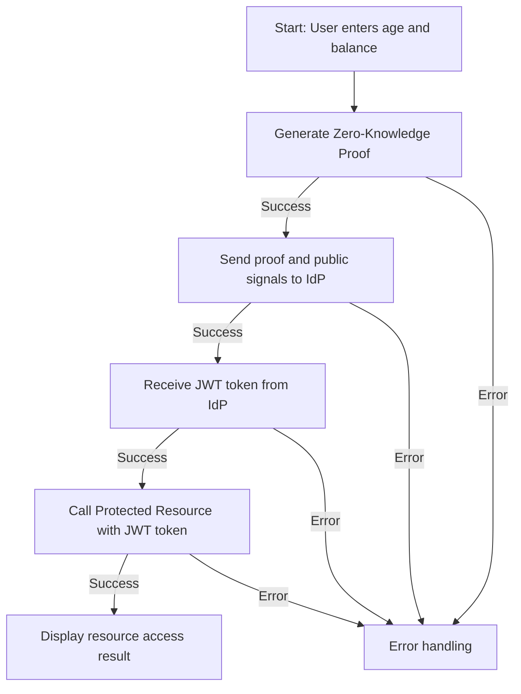

```mermaid
flowchart TD
  A[Start: User enters age and balance]
  B[Generate Zero-Knowledge Proof]
  C[Send proof and public signals to IdP]
  D[Receive JWT token from IdP]
  E[Call Protected Resource with JWT token]
  F[Display resource access result]
  G[Error handling]

  A --> B
  B -->|Success| C
  B -->|Error| G
  C -->|Success| D
  C -->|Error| G
  D -->|Success| E
  D -->|Error| G
  E -->|Success| F
  E -->|Error| G
```