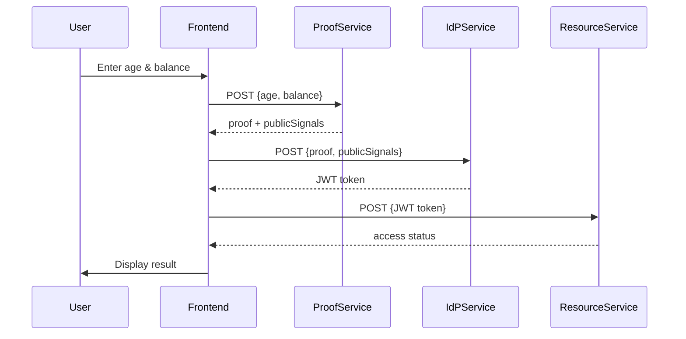

```mermaid
sequenceDiagram
  participant User
  participant Frontend
  participant ProofService
  participant IdPService
  participant ResourceService

  User->>Frontend: Enter age & balance
  Frontend->>ProofService: POST {age, balance}
  ProofService-->>Frontend: proof + publicSignals
  Frontend->>IdPService: POST {proof, publicSignals}
  IdPService-->>Frontend: JWT token
  Frontend->>ResourceService: POST {JWT token}
  ResourceService-->>Frontend: access status
  Frontend->>User: Display result
```